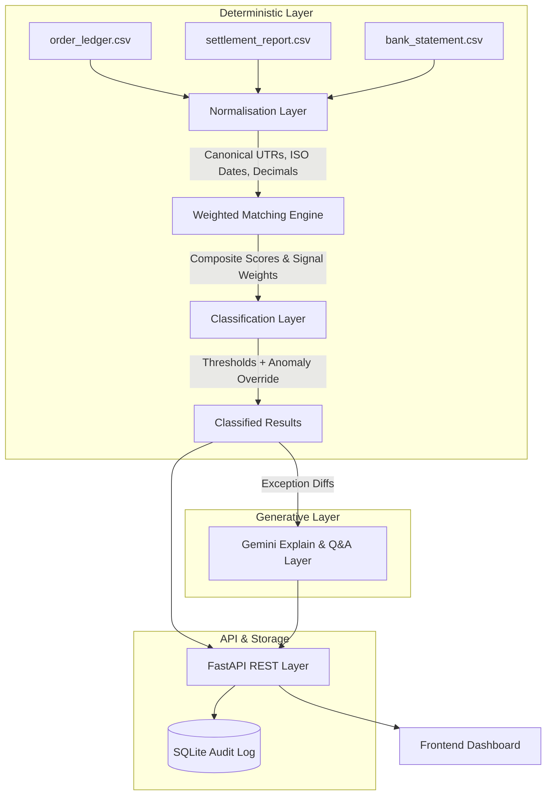

# ReconAgent

**AI Finance Controller — Razorpay Buildathon**

## 1. What is ReconAgent?

Merchants who accept payments via a payment gateway receive three separate, independently-formatted data streams: an internal order ledger (what they sold), a gateway settlement report (what the gateway claims it paid out), and a bank statement (what actually hit the bank account). Reconciling these three datasets manually in spreadsheets does not scale. Mismatches caused by partial refunds, fee-rounding differences, delayed settlements, failed payments, or duplicate payouts often go undetected or are silently written off because investigating them by hand takes too long. ReconAgent automates this entire pipeline. It normalises the sources, deterministically scores and matches transactions, classifies every outcome, and surfaces plain-language explanations for anomalies that require human review — backed by a complete, immutable audit trail.

## 2. Core Architectural Principle

**Matching is 100% deterministic; the LLM never decides a match.** 

Every match decision is produced by a weighted matching engine using explicit, auditable rules and numeric scores. The LLM (Google Gemini) operates exclusively in a post-hoc explain-and-answer role: it receives already-decided results and generates natural-language explanations or answers questions about them. 

This strict separation of concerns is a hard architectural requirement for a finance tool. LLM outputs are probabilistic and non-deterministic; a match decision that cannot be traced back to a specific, reproducible rule and score cannot be defended to a merchant disputing a classification. By restricting the LLM to explanation only, we guarantee that the system remains robust, auditable, and safe to run at scale.

## 3. System Architecture



## 4. Data Flow: An End-to-End Example

Consider the reconciliation of order `ORD2024046`, which contains a subtle rounding anomaly:
1. **Normalisation:** The raw records are ingested. Amounts are coerced to `decimal.Decimal` rather than floats (preventing IEEE 754 precision drift). The bank UTR is canonicalised (hyphens stripped, lowercased).
2. **Weighted Matching Engine:** The engine evaluates candidate pairs. The UTR matches perfectly (full weight), the date matches (full weight), but the amount has a small ₹0.66 difference (likely a GST rounding artefact). The engine calculates a composite match score of **0.9822**.
3. **Classification (Anomaly Override):** A score of 0.9822 falls into the highest confidence band (`AUTO_MATCHED` threshold is 0.97). However, the classification layer applies a secondary anomaly override: `amount_diff > ₹0.50`. This immediately flags the transaction and downgrades it to `NEEDS_REVIEW` under the `ROUNDING_DIFF` subtype.
4. **Audit Trail:** An append-only entry is committed to the SQLite database detailing the exact 0.9822 score, the matched candidates, and the specific anomaly flag that triggered the manual review.

## 5. Tech Stack

| Component | Technology | Justification |
|-----------|------------|---------------|
| **Database** | SQLite | Zero setup cost, swappable via SQLAlchemy; no concurrent writers in this context. |
| **LLM Provider** | Google Gemini API (`gemini-2.5-flash`) | Free tier available without credit card, providing good reasoning at low latency. |
| **LLM SDK** | `google-genai` (v1.47+) | Official successor to the deprecated `google-generativeai` package, avoiding technical debt. |
| **Amount Math** | `decimal.Decimal` | Avoids float arithmetic drift; ₹0.01 differences are treated as meaningful signals. |
| **Backend API** | FastAPI | Rapid development with native Pydantic v2 support for strict schema validation. |
| **Frontend** | React + Vite + Tailwind CSS | Fast compilation, clean and structured data-dense aesthetics. |

## 6. API Reference

- `POST /api/reconcile/run` — Triggers the pipeline. (e.g. returns `{"status_counts": {"AUTO_MATCHED": 39...}, "runtime_ms": 16}`)
- `GET /api/metrics` — Aggregate summary stats for dashboard KPIs (match rate, total ₹ processed, avg runtime).
- `GET /api/transactions` — Paginated, filterable transaction list; stable sort by `order_id`.
- `GET /api/exceptions` — Near-miss sorted list of exceptions, prioritised from `NEEDS_REVIEW` to `UNRESOLVED`.
- `GET /api/exceptions/{id}/explain` — Fetches LLM explanation using in-memory cache. (e.g. `{"explanation": "...", "llm_status": "ok"}`)
- `POST /api/chat` — Natural-language Q&A using heuristic context retrieval. (e.g. `{"query": "Why did ORD2024046 fail?"}`)
- `GET /api/audit-log` — Append-only audit trail records, filterable by `event_type`.

## 7. Measured Results

**Honest Exception Philosophy:** A 100% resolution rate is a red flag. The system must correctly surface genuinely unresolvable exceptions rather than forcing matches.

**Score-Band Metrics (Intermediate layer):**
- `CLEAN_MATCH`: 42/42 in `HIGH` band.
- `FAILED_PAYMENT`: 3/3 in `LOW` band.
- `HARD_MISMATCH` score-band recall: 6/9 (0.67). (3 cases scored `HIGH` due to perfect amount/UTR despite date differences, correctly caught by classification override below).

**End-to-End Pipeline Metrics (Matching + Classification):**
- `AUTO_MATCHED` precision: 1.0 (42/42 correct, 0 false positives).
- `HARD_MISMATCH` recall: 1.0 (9/9 routed to `NEEDS_REVIEW`, 0 missed).
- `FAILED_PAYMENT` recall: 1.0 (3/3 `UNRESOLVED`, 0 missed).
- Phantom credits: 3/3 detected.
- Duplicate settlements: 3/3 detected.

**Throughput:**
- Rules engine processes ~79,000 orders/sec.
- Pipeline execution latency (local Macbook): ~16ms for N=60, ~818ms for N=600.

## 8. Known Limitations

- **Threshold Calibration:** The current anomaly-flag thresholds (e.g., `amount_diff > ₹0.50`, `date_diff > 5 days`) have narrow margins against the synthetic dataset. Real-world recalibration against historical merchant data is required before production deployment.
- **Audit Log Mutability:** The SQLite audit log is append-only by application design, but lacks cryptographic tamper-evidence (hash-chaining). In-process file modifications would not be automatically detected.
- **LLM Rate Limits:** The Gemini free tier is constrained to ~5 requests/minute. We mitigate this using exponential backoff, content-hash caching, and graceful fallback (returning structured raw diffs without blocking reconciliation), but heavy concurrent explanations will trigger fallbacks.

## 9. Project Structure

```text
recon-agent/
├── CONTEXT.md              # Project identity and strict architectural constraints
├── ARCHITECTURE.md         # Living design document & decision log
├── CONVENTIONS.md          # Python style, testing rules, commit format
├── TASKS.md                # Build checklist
├── README.md               # This file
├── backend/
│   ├── app/
│   │   ├── main.py         # FastAPI entrypoint
│   │   ├── models/         # Pydantic and SQLAlchemy schemas
│   │   ├── services/       # Core business logic (matching, classification, LLM)
│   │   └── api/            # API route handlers
│   ├── data/               # Synthetic data generators & seed data
│   ├── requirements.txt
│   └── .env.example
└── frontend/               # Vite/React/Tailwind dashboard application
```

## 10. Setup Instructions

**Prerequisites:** Python 3.11+, Node.js, and a Google Gemini API Key.

1. **Clone the repository:**
   ```bash
   git clone <repo-url>
   cd recon-agent
   ```
2. **Backend Setup:**
   ```bash
   python -m venv .venv
   source .venv/bin/activate
   pip install -r backend/requirements.txt
   
   cp backend/.env.example backend/.env
   # Add your GEMINI_API_KEY to backend/.env
   
   python backend/data/demo_seed.py # Generate curated demo dataset
   
   cd backend
   uvicorn app.main:app --port 8765
   ```
3. **Frontend Setup:**
   ```bash
   # In a new terminal
   cd frontend
   npm install
   npm run dev
   # Access dashboard at http://localhost:5173
   ```

## 11. Testing

The project uses `pytest` and maintains strict test coverage. Tests live directly alongside the modules they cover.
- 159/159 tests currently pass.
- Covers unit testing for individual match signals, integration testing against dataset ground truths, and edge cases (e.g. empty CSVs, negative amounts, ambiguous bank matches, missing dependencies).
- To run tests:
  ```bash
  source .venv/bin/activate
  pytest backend/ -v
  ```
